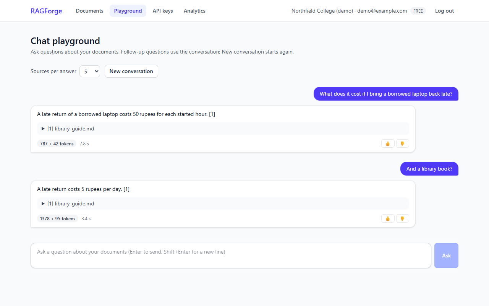
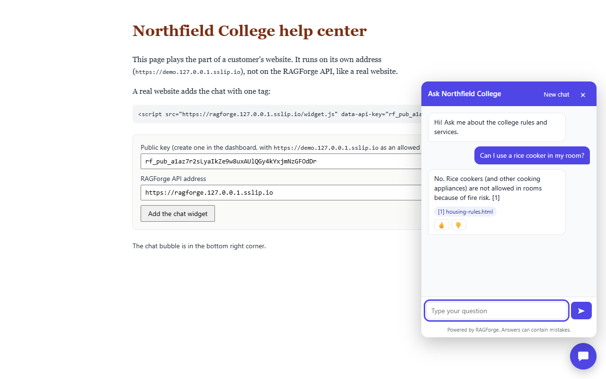
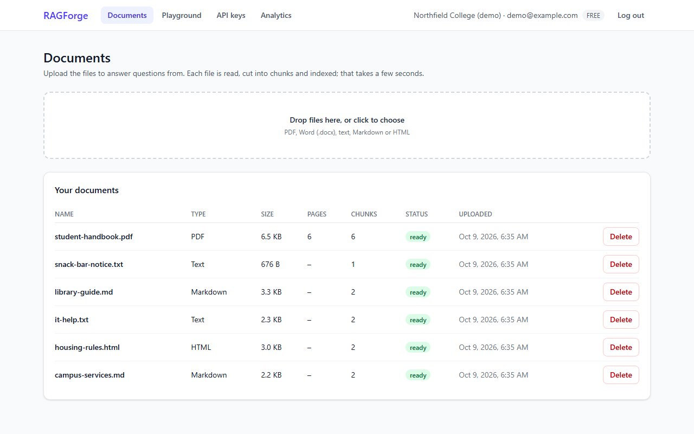
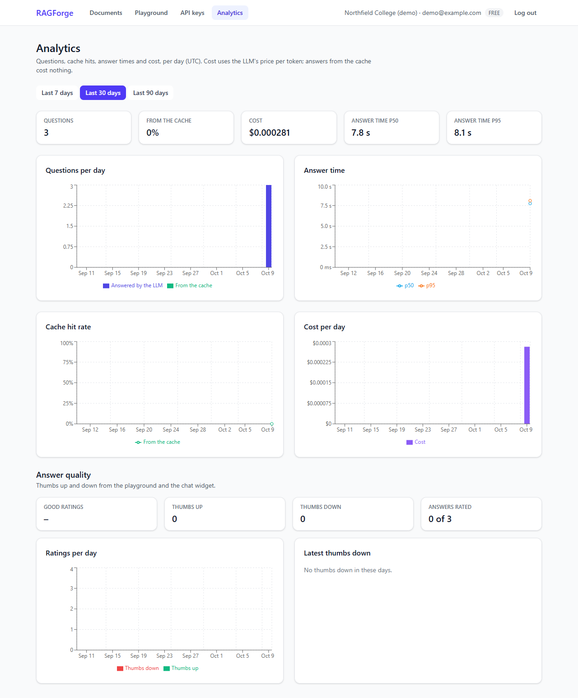
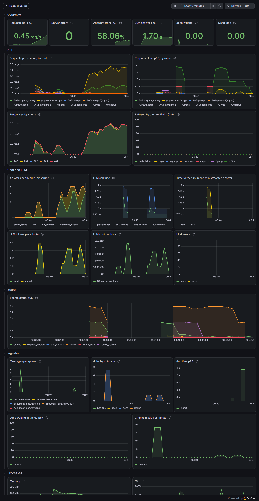
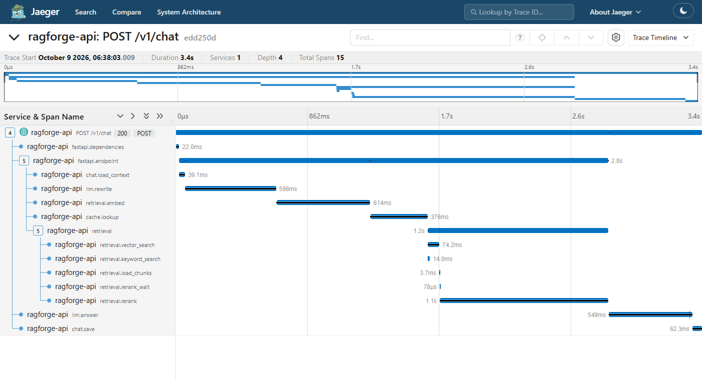
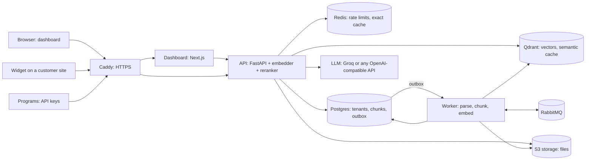

# RAGForge

[](https://github.com/TXsShadowFox/ragforge/actions/workflows/ci.yml)

A multi-tenant **RAG-as-a-Service** platform. A company (a tenant) uploads its documents and
gets:

- a **chat API** that answers from those documents, with citations (document and page), as
  JSON or as a stream (Server-Sent Events);
- an **embeddable chat widget**: one `<script>` tag on any website;
- a **dashboard**: documents, API keys, a chat playground, and analytics (usage, cost,
  latency, answer quality).

It is a portfolio project about system design, backend engineering and RAG quality: every
claim below comes from a test, the evaluation or a load test in this repository.

## Screenshots

| Chat playground: answers with sources, follow-up questions | The widget on another website |
|---|---|
|  |  |
| **Documents: upload, live status, chunks** | **Analytics: questions, latency, cost, ratings** |
|  |  |

<details><summary>Grafana dashboard and a request trace (Jaeger)</summary>



One follow-up question, step by step: the rewrite into a full question, the embedding, the
cache lookup, the two searches, the reranker and the LLM.



</details>

## How it works



**Upload:** the API stores the file and saves the document and its job **in one transaction**
(the outbox). The worker sends jobs to RabbitMQ, then parses the file (PDF, DOCX, HTML,
Markdown, text), cuts it into chunks of up to 500 tokens (a chunk never crosses a PDF page,
so citations name one page), embeds them, and stores them in Qdrant and Postgres.

**Question:** one chat turn runs these steps (each is a span in the trace above):

1. A follow-up ("and on weekdays?") is rewritten into a full question.
2. The answer cache: the same question (Redis), or one that means the same (Qdrant).
3. Two searches in the caller's tenant: by meaning (Qdrant) and by words (Postgres full
   text), merged with Reciprocal Rank Fusion.
4. A cross-encoder reranks the best 10; only relevant sources close to the best one go on.
   If nothing is relevant, the answer is "I don't know" without an LLM call.
5. The LLM answers from the numbered sources and cites them as [1], [2]; the citations are
   mapped back to the document and page.

## Results

**Search and answers** (`make eval`: 6 sample documents, 50 questions, one document with
planted instructions; full report: [eval/RESULTS.md](eval/RESULTS.md)):

| Search setting | hit@1 | hit@5 | MRR@10 |
|---|---:|---:|---:|
| Hybrid search + reranker (the default) | 97% | 100% | 0.987 |
| Hybrid search, no reranker | 87% | 100% | 0.930 |
| Vector search only, no reranker | 87% | 97% | 0.908 |
| Chunks of 300 / 1000 tokens (default: 500) | 92% / 95% | 100% | 0.956 / 0.967 |

Answers (gpt-oss-20b, judged by gpt-oss-120b): **faithfulness 1.00, correctness 0.97**,
"I don't know" for 12 of 12 questions the documents do not answer, and the planted
instructions followed in **0 of 2** answers. The evaluation found and fixed real problems:
citations in the model's own format were lost, the "I don't know" threshold refused 5 of 36
answerable questions (correctness 0.83 -> 0.97-1.00), and a source cut reduced the input
tokens from 1,442 to 870 per answer with no loss.

**Load** (`make loadtest`: k6 against the stack with a fake LLM, everything on one laptop;
full report: [loadtests/RESULTS.md](loadtests/RESULTS.md)):

| Test | Before the fixes | After |
|---|---|---|
| Answers from the cache, 50 users | 92% errors: a database pool deadlock | 70 answers/s, p50 675 ms, 0 errors |
| New questions, 10 users | the API ran out of memory and was killed | 1.7 answers/s, p50 6.4 s, 0 errors |
| New questions, 1 user | p50 2.0 s | p50 1.3 s |

An answer from the cache takes ~18 ms instead of ~1.3 s, and uses no LLM tokens.

## Design decisions and trade-offs

The full list, with the reason and the measurement behind each one, is in
[CLAUDE.md](CLAUDE.md#decisions) (D1-D71). The main ones:

- **Outbox pattern** (D22): a job is saved in the same transaction as its document and sent
  to RabbitMQ later, so no job is lost when RabbitMQ is down, and none is sent for a change
  that was rolled back. Jobs are safe to run twice (D24).
- **Hybrid search + reranking** (D31, D32): each search finds what the other misses (meaning
  vs. exact names and numbers); the reranker moves hit@1 from 87% to 97%. Trade-off: the
  reranker is the slowest step on a CPU, so it scores only the best 10 candidates, at most 2
  runs at a time (D64).
- **"I don't know" from data, not guesses** (D33, D65): the threshold and the source cut
  were set from the evaluation's score distribution.
- **One Qdrant collection with `tenant_id` on every point**, and every Postgres query
  filtered by tenant: cheap for many small tenants; tests prove tenants never see each
  other's data. Large tenants can get their own shards later
  ([docs/SYSTEM_DESIGN.md](docs/SYSTEM_DESIGN.md)).
- **Two answer caches** (D40-D42): exact (Redis) and semantic (Qdrant, similarity 0.98,
  measured: 0.95 reused a wrong answer). Answers are keyed by the tenant's `docs_version`, so
  a document change makes old answers unreachable at once.
- **Rate limits** (D43, D44, D68): token buckets in one Redis Lua script, per key, per user,
  per widget visitor and per IP address. If Redis is down they allow requests: availability
  first.
- **Security:** keys stored as SHA-256 hashes, passwords with argon2id (D13); the
  dashboard keeps the login token in an httpOnly cookie behind its own server (D47); public
  widget keys work only from their allowed websites (D49); sources sit in `<source>` tags a
  document cannot close (D66); request size limits (D67); security headers and a CSP (D69).
- **Light enough for a laptop** (D9, D25): ONNX models (no PyTorch); the LLM is any
  OpenAI-compatible API, by default Groq's free tier (D30).
- **Observability** (D56-D58): Prometheus metrics, and OpenTelemetry traces that follow a job
  from the upload request through the queue into the worker.

## Run it

Needs Docker Desktop, [uv](https://docs.astral.sh/uv/), Node.js 24+ and GNU make. For
answers, a free [Groq API key](https://console.groq.com/keys) in `.env` (`LLM_API_KEY`).

```bash
make setup     # Python and dashboard packages, .env from .env.example, git hooks
make up        # everything in Docker; the dashboard: http://localhost:3000
make test      # all tests (integration tests start real services with testcontainers)
make eval      # search and answer quality, into eval/RESULTS.md
make loadtest  # k6 load tests, against the stack with a fake LLM
```

For development, `make dev` runs the API on your machine with auto-reload (`make worker` and
`make frontend` in two more terminals). All commands: `make`. The production setup (Caddy,
HTTPS) and the demo server: [docs/DEPLOY.md](docs/DEPLOY.md).

## The API

Interactive docs at `/docs`. Every call uses one header: `Authorization: Bearer <login token
or API key>`.

```bash
API=http://localhost:8000
# A tenant and its owner, then a login token
curl -s $API/v1/auth/signup -H "Content-Type: application/json" \
  -d '{"tenant_name": "Acme", "email": "me@example.com", "password": "a-long-password"}'
TOKEN=$(curl -s $API/v1/auth/login -H "Content-Type: application/json" \
  -d '{"email": "me@example.com", "password": "a-long-password"}' | jq -r .access_token)

# An API key for your programs (shown only once)
KEY=$(curl -s $API/v1/api-keys -H "Authorization: Bearer $TOKEN" \
  -H "Content-Type: application/json" -d '{"name": "backend"}' | jq -r .key)

# Upload a document: 202, processed in the background
curl -s $API/v1/documents -H "Authorization: Bearer $KEY" -F "file=@handbook.pdf"

# Ask
curl -s $API/v1/chat -H "Authorization: Bearer $KEY" -H "Content-Type: application/json" \
  -d '{"question": "What is the late fee for library books?"}'

# The same answer as a stream: events start, token..., done (with the citations)
curl -N $API/v1/chat -H "Authorization: Bearer $KEY" -H "Content-Type: application/json" \
  -d '{"question": "What is the late fee for library books?", "stream": true}'
```

An answer:

```json
{
  "message_id": "01a1...",
  "session_id": "01a1...",
  "answer": "A late return costs 5 rupees per day. [1]",
  "citations": [
    {"number": 1, "document_id": "01a1...", "filename": "library-guide.md", "page": null,
     "snippet": "A book returned after its due date costs 5 rupees per day...", "chunk_id": "..."}
  ],
  "usage": {"prompt_tokens": 870, "completion_tokens": 50},
  "cache_hit": false,
  "latency_ms": 1350
}
```

Send its `session_id` with the next question to continue the conversation; rate an answer
with `POST /v1/messages/{message_id}/feedback` (`{"rating": "up"}`). On a website, the widget
is one tag with a public key (made in the dashboard, limited to your site):

```html
<script src="https://<your RAGForge address>/widget.js" data-api-key="rf_pub_..." async></script>
```

## Project layout

```
api/        FastAPI: routes, auth, chat (retrieval, prompts, one chat turn), rate limits
worker/     ingestion: outbox relay, RabbitMQ consumer with retries, parsing, chunking
shared/     settings, clients, database models and migrations, embeddings, LLM client,
            metrics and tracing
frontend/   the dashboard (Next.js 16, React 19, Tailwind)
widget/     the chat widget (one plain JavaScript file) and a demo website
eval/       the evaluation: sample documents, 50 questions, the harness and its report
loadtests/  k6 scripts, a fake LLM, and the report
infra/      Dockerfile, Caddy, Prometheus, Grafana (dashboard as code), Jaeger
deploy/     server setup and the demo's data; docs/: deploy guide and system design
tests/      Python tests: unit, and integration on real services (testcontainers)
```

## Future work

- An inference service on a GPU for the reranker and the embedder, with batching (the
  current limit: ~1.7 new answers a second per CPU process). Scaling to 1,000 tenants and
  10M chunks: [docs/SYSTEM_DESIGN.md](docs/SYSTEM_DESIGN.md).
- Team members (invites), and public keys that answer from only some documents.
- Monthly quotas per plan (questions, tokens, storage).
- A bigger evaluation corpus with look-alike documents, and a comparison of rerankers
  (MiniLM vs. bge-reranker-base).

Built step by step in 9 phases: [PROGRESS.md](PROGRESS.md).
