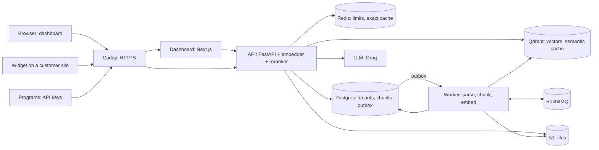
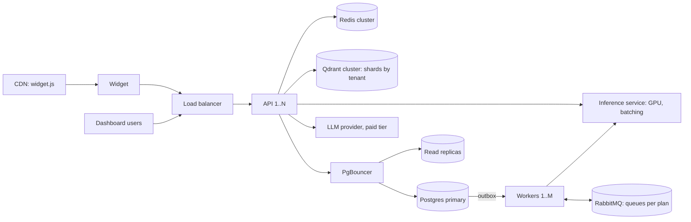

# System design: from one server to 1,000 tenants and 10M chunks

Today RAGForge runs on one machine (the demo: 2 ARM CPUs, 12 GB). This document shows where
that setup stops and what changes, step by step, to serve **1,000 tenants with 10 million
chunks**. It starts from numbers we measured (`eval/RESULTS.md`, `loadtests/RESULTS.md`);
numbers we did not measure are marked as estimates.

## Today

What we measured on one laptop (one API process, everything on the same machine):

| Path | Throughput | Notes |
|---|---|---|
| Answer from the cache | ~70 a second (50 users, p50 675 ms) | one Python process is the limit |
| New question (whole RAG path) | ~1.7 a second (p50 1.3 s alone) | the reranker's CPU is the limit (0.84 s for 10 chunks) |
| Upload | ~55 a second | the worker then embeds ~8 small documents a second |
| One answer's prompt | 870 input + 50 output tokens | 1.7 sources per answer |

The design already has the parts that scale out: the API keeps no state (limits and caches
are in Redis, jobs go through the outbox), jobs are safe to run twice, and every query is
scoped to one tenant.

## The size of 10M chunks

| What | Per chunk | 10M chunks |
|---|---|---|
| Vector (384 float32 numbers, bge-small) | 1.5 KB | **15.4 GB** |
| ...with int8 scalar quantization (in RAM; originals on disk) | 0.4 KB | **3.8 GB** |
| HNSW graph (m=16; estimate) | ~0.13 KB | ~1.3 GB |
| Chunk text in Postgres (up to 500 tokens; ~2 KB average, estimate) | ~2 KB | ~20 GB |
| Full-text data (tsvector + GIN index; estimate) | ~1.5 KB | ~15 GB |

So the vectors fit in one large Qdrant node's RAM only with quantization, and Postgres holds
~35-40 GB of chunk data: still one database server, but no longer a small one.

A load assumption (estimate): 1,000 tenants x 2,000 questions a day = 2M questions a day,
~23 a second on average, ~70 at peak. With 30% answered from the cache, ~50 new questions a
second at peak, ~30 times what one CPU process does today.

## What changes

### 1. The reranker and the embedder become one inference service

The reranker is the first limit (D64): ~1.7 new answers a second per CPU process, and each
run needs a few hundred MB. Running the models in every API copy wastes memory (~1 GB each)
and cannot batch questions together.

- One inference service (for example Text Embeddings Inference or Triton) on a GPU, with
  dynamic batching: questions that arrive at the same time are scored together.
- Estimate: a T4-class GPU scores 10 chunks of 512 tokens in tens of milliseconds, so one GPU
  covers the ~50 reranks a second at peak, with room to spare. Two for availability.
- The API copies become small (no models): more of them per server.
- Keep `RERANK_CANDIDATES` (10) and measure every change with `make eval`; the evaluation
  showed no quality loss from 20 to 10.

### 2. More API copies behind a load balancer

The API keeps no state, so copies can be added freely. The things that must be shared
already are: rate limits (one Lua script in Redis), the exact cache (Redis), the semantic
cache (Qdrant), and jobs (the outbox in Postgres). Behind the load balancer, uvicorn trusts
`X-Forwarded-For` only from it (D68), or every visitor has the balancer's address.

### 3. Postgres: fewer connections, partitions, replicas

- **PgBouncer** (transaction pooling): 30 API copies x 15 pooled connections = 450
  connections, too many for one Postgres. PgBouncer shares ~50 real ones. The load test
  showed why connections must be held only for short steps (D63: a request that kept one
  while waiting deadlocked the pool).
- **Partition `chunks` by `hash(tenant_id)`** (for example 16 partitions): each search reads
  one partition's GIN index, and a big tenant's re-index does not lock everybody.
- **Read replicas** for the keyword search, loading chunks and analytics; writes (answers,
  documents, the outbox) stay on the primary. A replica can lag behind: a document that just
  became ready may be missing for a second, which is fine for search.
- Old chat messages move to cheaper storage after N days; `usage_daily` keeps the totals.

### 4. Qdrant: quantization, then shards by tenant

- **int8 scalar quantization** with the originals on disk: 15.4 GB of vectors become 3.8 GB
  in RAM, with a small rescoring step for accuracy.
- **Tenant-aware indexes:** today one collection with `tenant_id` on every point and a
  payload index. Qdrant can build the HNSW graph per tenant (`is_tenant` payload index), so
  a search never walks other tenants' points.
- **Shards by tenant** (custom sharding with a shard key): a group of tenants per shard,
  spread over 3+ nodes, replication factor 2. A very large tenant gets its own shard key, and
  can move to its own node without touching the others.

### 5. Workers: more of them, and fair queues

- More worker processes, as competing consumers on RabbitMQ: jobs are safe to run twice
  (D24), so a crash only means a retry.
- Embedding on the inference service's GPU instead of the worker's CPU (today ~5-8 chunks a
  second per worker).
- **Fairness:** one tenant uploading 10,000 files must not delay everybody's "ready". A
  queue per plan (or per big tenant) with its own consumers, and a per-tenant limit on jobs
  in flight.

### 6. Caching and the LLM

- The answer cache already saves whole LLM calls: an exact hit took 18 ms instead of 1.3 s
  (D41). At scale, a Redis cluster and a bigger semantic cache.
- The LLM becomes a paid tier with higher limits (or a self-hosted model on vLLM). Cost per
  new answer at gpt-oss-20b prices: 870 x $0.075/M + 50 x $0.30/M = **$0.00008**, so 1M
  answers cost about $80 in LLM tokens. `SOURCE_SCORE_MARGIN` already cut the input tokens
  from 1,442 to 870 (D65).

### 7. The widget from a CDN

`widget.js` is one static file. A CDN with a versioned URL (`widget.v3.js`, cached for a
year) takes all those requests off the API. Today the API serves it with a 5-minute cache.

### 8. Limits and quotas per plan

Today: requests and questions per minute (per key and per visitor), documents per tenant.
At scale, add monthly quotas (questions, tokens, storage) per plan, counted from
`usage_daily`, so one tenant cannot use up a shared LLM budget.

## What can fail, and what happens

| Failure | What happens (already today) |
|---|---|
| Redis down | limits allow requests, the exact cache is a miss, chat still works (D44) |
| RabbitMQ down | uploads still succeed; jobs wait in the outbox and are sent later (D22) |
| A worker crashes during a job | the message comes back; the job is safe to run twice (D24) |
| The LLM is busy (429) or down | 503 with Retry-After; streamed answers end with an `error` event (D38) |
| Too much load | questions wait in the reranker's queue instead of crashing the API (D64) |
| Qdrant down | search fails: 503. At scale, replication factor 2 keeps a copy online |

## Observability at scale

Prometheus metrics stay per process without tenant labels (D56); per-tenant numbers come
from the analytics tables. Traces are sampled (`TRACE_SAMPLE_RATIO`, for example 5%) and sent
to a managed OTLP backend. The key alerts: p95 time per search step, the reranker's queue
wait (`rerank_wait`), the outbox backlog, dead jobs, and LLM errors.

## Order of work

1. PgBouncer and more API copies: cheap, and needed first.
2. The inference service on a GPU: removes the biggest limit (the reranker).
3. Qdrant quantization, then sharding by tenant, when vectors near the RAM of one node.
4. Postgres partitions and read replicas, when chunks pass ~20-30 GB.
5. Fair queues and quotas, when the first large tenant arrives.
